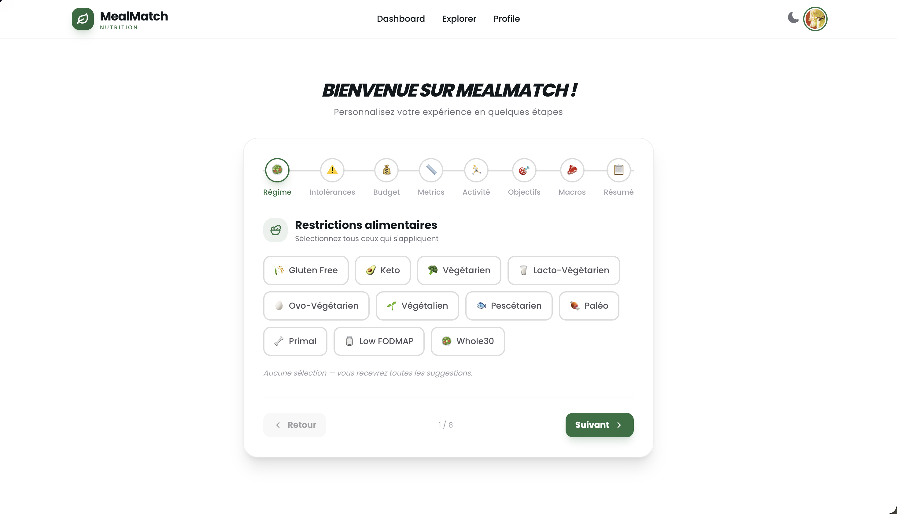
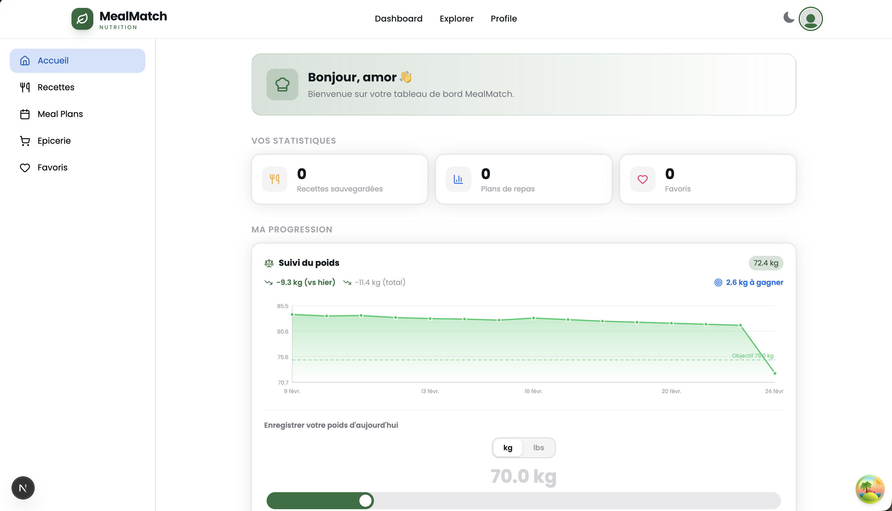
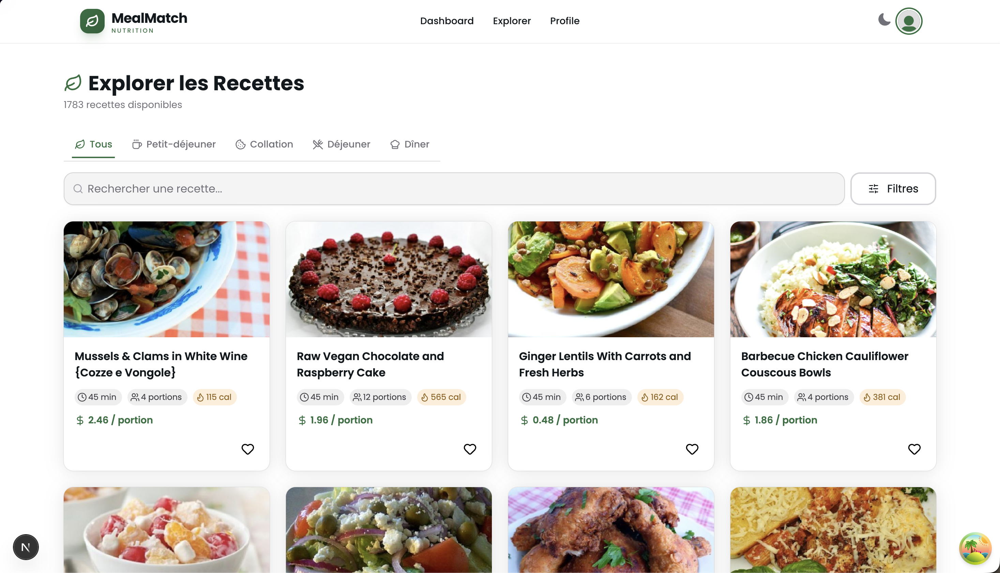

# MealMatch

Application web qui génère des plans de repas hebdomadaires adaptés au budget étudiant, avec recettes faciles, liste d'épicerie automatique et suivi nutritionnel.

---

## Aperçu






## Fonctionnalités

- **Exploration de recettes** — recherche filtrée par ingrédients, nutriments, régime alimentaire et allergies
- **Génération de plan de repas** — planning hebdomadaire adapté au budget et aux préférences
- **Liste d'épicerie automatique** — générée à partir du plan de repas
- **Suivi nutritionnel** — calories, protéines, glucides, lipides par repas
- **Favoris** — sauvegarder et retrouver ses recettes préférées
- **Partage de recette** — via lien URL
- **Onboarding personnalisé** — profil utilisateur (budget, restrictions, objectifs, métriques corporelles)
- **Abonnements** — plans Free, Premium et Pro via Stripe
- **Thème clair / sombre** — basculement automatique ou manuel
- **Authentification** — Google, GitHub, ou courriel + mot de passe

---

## Tech Stack

| Couche           | Outil                                     |
| ---------------- | ----------------------------------------- |
| Framework        | Next.js 15 (App Router, Turbopack)        |
| Langage          | TypeScript                                |
| UI Library       | HeroUI (basé sur React Aria)              |
| Styling          | Tailwind CSS v4                           |
| Police           | Poppins (Google Fonts)                    |
| Icônes           | lucide-react                              |
| Animations       | framer-motion                             |
| Notifications    | sonner                                    |
| Authentification | NextAuth v5 (Google, GitHub, Credentials) |
| Base de données  | Supabase (PostgreSQL)                     |
| API recettes     | Spoonacular API                           |
| IA               | OpenAI API                                |
| State Management | TanStack Query v5                         |
| Formulaires      | react-hook-form + zod                     |
| Paiements        | Stripe                                    |
| Cache            | Upstash Redis                             |
| Déploiement      | Vercel                                    |

---

## Structure du projet

```
MealMatch/
├── app/
│   ├── (public)/          # Pages accessibles sans connexion
│   │   ├── page.tsx       # Landing page / redirection
│   │   ├── login/
│   │   ├── signup/
│   │   ├── onboarding/
│   │   ├── pricing/
│   │   ├── about/
│   │   ├── features/
│   │   ├── blog/
│   │   └── ...
│   ├── (private)/         # Pages protégées (authentification requise)
│   │   ├── dashboard/
│   │   ├── explore/
│   │   ├── meal-plan/
│   │   │   ├── generate/
│   │   │   ├── epicerie/
│   │   │   ├── favoris/
│   │   │   └── recettes/
│   │   ├── profile/
│   │   ├── settings/
│   │   └── billing/
│   └── api/               # API routes Next.js
├── components/            # Composants React réutilisables
├── hooks/                 # Hooks personnalisés
├── lib/                   # Clients (Supabase, Stripe, Spoonacular…)
├── types/                 # Types TypeScript
├── utils/                 # Fonctions utilitaires
├── styles/                # CSS global
├── supabase/              # Migrations et schéma de base de données
├── scripts/               # Scripts de seed
├── docs/                  # Documentation interne
├── UML/                   # Diagrammes UML
├── auth.ts                # Configuration NextAuth
├── DESIGN_SYSTEM.md       # Guide de design (à lire avant de contribuer)
└── README.md
```

---

## Démarrage rapide

### Prérequis

- Node.js 20+
- pnpm (`npm install -g pnpm`)
- Compte [Supabase](https://supabase.com)
- Clé API [Spoonacular](https://spoonacular.com/food-api)
- Compte [Stripe](https://stripe.com)
- Compte [Upstash](https://upstash.com) (Redis)
- Clé API [OpenAI](https://platform.openai.com)

### Installation

```bash
# 1. Cloner le repo
git clone https://github.com/RimaNafougui/MealMatch
cd MealMatch

# 2. Installer les dépendances
pnpm install

# 3. Copier les variables d'environnement
cp .env.example .env.local

# 4. Remplir les variables (voir section ci-dessous)

# 5. Lancer le serveur de développement
pnpm dev
```

L'application sera disponible sur `http://localhost:3000`.

---

## Variables d'environnement

```env
# Supabase
NEXT_PUBLIC_SUPABASE_URL=
NEXT_PUBLIC_SUPABASE_ANON_KEY=
SUPABASE_SERVICE_ROLE_KEY=

# NextAuth
AUTH_SECRET=
AUTH_GOOGLE_ID=
AUTH_GOOGLE_SECRET=
AUTH_GITHUB_ID=
AUTH_GITHUB_SECRET=

# Spoonacular
SPOONACULAR_API_KEY=

# OpenAI
OPENAI_API_KEY=

# Stripe
STRIPE_SECRET_KEY=
NEXT_PUBLIC_STRIPE_PUBLISHABLE_KEY=
STRIPE_WEBHOOK_SECRET=

# Upstash Redis
UPSTASH_REDIS_REST_URL=
UPSTASH_REDIS_REST_TOKEN=
```

---

## Scripts disponibles

```bash
pnpm dev          # Démarrage en développement (Turbopack)
pnpm build        # Build de production
pnpm start        # Démarrage en production
pnpm lint         # Lint + auto-fix
pnpm seed:recipes # Seed des recettes en base de données
```

---

## Documentation technique

### Spoonacular API

Utilisée pour les recettes, vidéos, valeurs nutritionnelles et listes d'épicerie.

| Endpoint                             | Description                              |
| ------------------------------------ | ---------------------------------------- |
| `/recipes/complexSearch`             | Recherche par mots-clés, filtres, budget |
| `/recipes/{id}/analyzedInstructions` | Instructions de préparation              |
| `/recipes/findByNutrients`           | Recettes par nutriments (min/max)        |
| `/recipes/findByIngredients`         | Recettes par ingrédients disponibles     |
| `/food/videos/search`                | Vidéos YouTube associées                 |

### Supabase

Stockage des données utilisateurs : profil, favoris, plans de repas, préférences et métriques. Les migrations sont dans `supabase/migrations/`.

### NextAuth v5

Authentification JWT avec trois providers : Google, GitHub et Credentials (email/mot de passe). La session est accessible côté serveur via `auth()` et côté client via `useSession()`.

### TanStack Query v5

Gère le cache des appels Spoonacular et Supabase. Assure la synchronisation après chaque action utilisateur (favoris, menus, profil).

### Stripe

Trois plans d'abonnement (Free, Premium, Pro). Les webhooks Stripe mettent à jour le plan utilisateur dans Supabase en temps réel.

### Upstash Redis

Cache des réponses Spoonacular pour réduire la consommation d'API et améliorer les temps de réponse.

---

## Design System

Consulter [`DESIGN_SYSTEM.md`](./DESIGN_SYSTEM.md) avant de contribuer. Ce document définit les règles de couleurs, typographie, composants, icônes et animations à respecter dans tout le projet.

---

## Équipe

| Membre                  | Rôle                    |
| ----------------------- | ----------------------- |
| **Rima Nafougui**       | Scrum Master            |
| **Jimmy Chhan**         | Développeur 1           |
| **Charly Smith Alcide** | Développeur 2           |
| **Julien Guibord**      | Développeur 3 / Testeur |

---

## Sources

- [Spoonacular API](https://spoonacular.com/food-api)
- [Next.js](https://nextjs.org/docs)
- [HeroUI](https://www.heroui.com/docs)
- [Tailwind CSS](https://tailwindcss.com/)
- [Supabase](https://supabase.com/docs)
- [NextAuth.js](https://authjs.dev/)
- [TanStack Query](https://tanstack.com/query/latest)
- [Stripe](https://docs.stripe.com/)
- [Upstash Redis](https://upstash.com/docs/redis)
- [OpenAI API](https://platform.openai.com/docs)
- [framer-motion](https://www.framer.com/motion/)
- [sonner](https://sonner.emilkowal.ski/)
