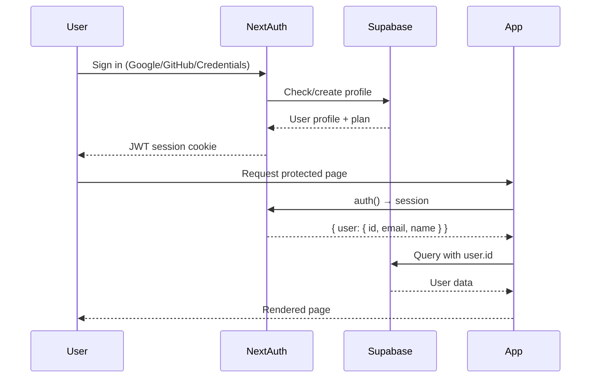

# Architecture — MealMatch

---

## Table of Contents

- [High-Level Overview](#high-level-overview)
- [Frontend Structure](#frontend-structure)
- [Backend Structure](#backend-structure)
- [External Services](#external-services)
- [Data Flow](#data-flow)
- [Authentication Flow](#authentication-flow)
- [State Management](#state-management)
- [Caching Strategy](#caching-strategy)
- [Plan Gating System](#plan-gating-system)
- [Security](#security)

---

## High-Level Overview

```
┌─────────────────────────────────────────────────────────────────┐
│                        CLIENT BROWSER                           │
│                                                                 │
│  ┌──────────────┐   ┌──────────────┐   ┌──────────────────┐   │
│  │  React UI    │   │  TanStack    │   │   next/navigation  │   │
│  │  (HeroUI +   │──▶│  Query Cache │   │   (App Router)    │   │
│  │   Tailwind)  │   │              │   │                  │   │
│  └──────┬───────┘   └──────────────┘   └──────────────────┘   │
└─────────┼───────────────────────────────────────────────────────┘
          │ HTTP / fetch()
          ▼
┌─────────────────────────────────────────────────────────────────┐
│                     NEXT.JS APP ROUTER                          │
│                    (Vercel — Edge / Node)                       │
│                                                                 │
│  ┌──────────────┐   ┌──────────────┐   ┌──────────────────┐   │
│  │  Page / RSC  │   │  API Routes  │   │   Middleware /   │   │
│  │  Components  │   │  (/app/api/) │   │   NextAuth.js    │   │
│  └──────────────┘   └──────┬───────┘   └──────────────────┘   │
└──────────────────────────────┼──────────────────────────────────┘
                               │
          ┌────────────────────┼─────────────────────┐
          │                    │                     │
          ▼                    ▼                     ▼
  ┌──────────────┐    ┌──────────────┐    ┌──────────────────┐
  │   Supabase   │    │   Upstash    │    │  External APIs   │
  │ (PostgreSQL) │    │   (Redis)    │    │                  │
  │              │    │   Cache      │    │  ┌────────────┐  │
  │  - profiles  │    │              │    │  │ Spoonacular│  │
  │  - meal_plans│    │  - recipes   │    │  │  (recipes) │  │
  │  - recipes   │    │  - meal plans│    │  └────────────┘  │
  │  - shopping  │    │  - sessions  │    │  ┌────────────┐  │
  │  - favorites │    │              │    │  │   OpenAI   │  │
  │  - ...       │    └──────────────┘    │  │ (GPT-4o-m) │  │
  └──────────────┘                        │  └────────────┘  │
                                          │  ┌────────────┐  │
                                          │  │   Stripe   │  │
                                          │  │ (billing)  │  │
                                          │  └────────────┘  │
                                          └──────────────────┘
```

---

## Frontend Structure

### App Router Layout

```
app/
├── layout.tsx                    # Root layout (Providers, fonts, metadata)
├── providers.tsx                 # QueryClient, SessionProvider, HeroUI, Themes
├── not-found.tsx                 # Global 404 page
├── error.tsx                     # Global error boundary
│
├── (public)/                     # Routes accessible without auth
│   ├── page.tsx                  # Root → redirects to /dashboard or /
│   ├── login/page.tsx
│   ├── signup/page.tsx
│   ├── onboarding/page.tsx
│   ├── pricing/page.tsx
│   ├── nutrition/page.tsx
│   └── layout.tsx                # Public layout with Navbar + Footer
│
└── (private)/                    # Auth-protected routes (redirect to /login)
    ├── layout.tsx                # Private layout with Navbar
    ├── profile/page.tsx
    ├── settings/page.tsx
    ├── explore/page.tsx
    ├── developer/page.tsx        # API key management (premium)
    └── dashboard/
        ├── layout.tsx            # Dashboard layout: sidebar (lg) + horizontal nav (mobile)
        ├── page.tsx              # Overview: stats, quick links, progress
        ├── recettes/page.tsx     # User recipes (saved + personal)
        ├── meal-plans/page.tsx   # Meal plan history
        ├── meal-plans/[id]/page.tsx  # Meal plan detail with calendar
        ├── meal-plan/generate/page.tsx  # AI generation wizard
        ├── epicerie/page.tsx     # Shopping lists
        ├── favoris/page.tsx      # Favorite recipes
        ├── nutritionist/page.tsx # AI nutritionist chat (premium)
        └── family/page.tsx       # Family member management (premium)
```

### Component Architecture

```
components/
├── layout/
│   ├── Navbar.tsx          # Top navigation (auth-aware, theme switch, profile dropdown)
│   └── Footer.tsx          # Site footer
│
├── dashboard/
│   ├── DashboardSidebar.tsx     # Left sidebar for desktop (collapsible)
│   └── ProgressDashboard.tsx    # Nutrition/activity progress cards
│
├── meal-plan/
│   ├── MealPlansDashboard.tsx   # Plans overview with calendar
│   ├── MealPlanCalendar.tsx     # Week view calendar
│   ├── MealPlanGrid.tsx         # Grid view of meals
│   ├── MealSlot.tsx             # Individual meal card in calendar
│   ├── MealDetailModal.tsx      # Recipe detail drawer
│   ├── GenerateConfig.tsx       # Days/meals config with plan gating
│   ├── MealPlanPaywallModal.tsx # Upgrade prompt when limit reached
│   ├── RepeatMealModal.tsx      # Clone plan to different week
│   └── UsageIndicator.tsx       # Monthly usage progress bar
│
├── recipes/
│   ├── recipe-card.tsx          # Recipe card with favorite toggle
│   └── AddRecipeModal.tsx       # Create/edit personal recipe form
│
├── ui/
│   └── PlanGate.tsx             # Blurred overlay for gated features
│
├── login/
│   ├── LoginForm.tsx            # Email/password login form
│   ├── button.tsx               # OAuth sign-in buttons (Google, GitHub)
│   └── dropdown.tsx             # User avatar dropdown menu
│
├── onboarding/
│   ├── OnboardingForm.tsx       # Multi-step onboarding wizard
│   └── OnboardingSteps.tsx      # Step indicator component
│
├── signup/
│   └── SignUpForm.tsx           # Registration form with username check
│
└── logo.tsx                     # MealMatch logo SVG
```

### Rendering Strategy

| Route | Strategy | Reason |
|---|---|---|
| Public pages (landing, pricing) | Server Components | SEO, fast initial load |
| Dashboard pages | Client Components | Interactive, user-specific data |
| API routes | Node.js runtime | DB access, secrets |
| Meal plan detail | Client Component | Complex interactions |
| Explore page | Client Component | Filters, pagination |

---

## Backend Structure

All backend logic lives in Next.js API routes (`app/api/`). There is no separate backend server.

### Request Lifecycle

```
Client fetch()
    │
    ▼
Next.js API Route Handler
    │
    ├─► auth()                    # Verify NextAuth session
    │       └── returns { user.id } or null → 401
    │
    ├─► getSupabaseServer()       # Service-role Supabase client
    │
    ├─► Plan check (if gated)    # profiles.plan → getLimits()
    │       └── insufficient → 403
    │
    ├─► withCache() (if cached)  # Upstash Redis lookup
    │       ├── HIT  → return cached JSON
    │       └── MISS → query Supabase
    │
    ├─► Supabase query           # DB read/write
    │
    └─► NextResponse.json()      # Return response
```

### Key Utilities

| Utility | Location | Purpose |
|---|---|---|
| `getSupabaseServer()` | `utils/supabase-server.ts` | Server-side Supabase client (service role) |
| `auth()` | `auth.ts` | Get current NextAuth session server-side |
| `withCache(key, ttl, fn)` | `utils/redis.ts` | Redis cache wrapper |
| `cacheDel(key)` | `utils/redis.ts` | Invalidate a cache key |
| `getLimits(plan)` | `utils/plan-limits.ts` | Get feature limits for a plan |
| `hasAccess(userPlan, req)` | `utils/plan-limits.ts` | Check plan access |
| `mealPlanRateLimit()` | `utils/rate-limit.ts` | Per-user rate limiting |

---

## External Services

### Spoonacular API
- **Purpose:** Recipe catalog data (titles, images, nutrition, ingredients, instructions)
- **Usage:** Used during recipe seeding (`scripts/seed:recipes`) and on-demand lookups
- **Caching:** Responses cached in Redis to minimize API quota usage
- **Rate limits:** 150 requests/day (free tier), 1500/day (paid)
- **Key endpoints:** `complexSearch`, `findByNutrients`, `findByIngredients`

### OpenAI (GPT-4o-mini)
- **Purpose:** AI meal plan generation + AI nutritionist chat
- **Model:** `gpt-4o-mini` (fast and cost-efficient)
- **Usage:**
  - `POST /api/meal-plan/generate` — generates a structured weekly meal plan as JSON
  - `POST /api/nutritionist` — nutritional Q&A chat (restricted to nutrition/fitness topics)
- **Prompt engineering:** System prompts enforce JSON output format and topic restrictions

### Supabase
- **Database:** PostgreSQL with 15 tables
- **Auth:** Used indirectly via NextAuth (profiles table linked to auth.users)
- **RLS:** Enabled but bypassed by service-role key in API routes
- **Storage:** Not used (images hosted on Spoonacular CDN)

### Stripe
- **Purpose:** Subscription billing (student, premium plans)
- **Integration:**
  - **Checkout:** redirect to Stripe-hosted payment page
  - **Webhooks:** update `profiles.plan` and `stripe_*` columns on subscription events
  - **Customer Portal:** self-service subscription management
- **Plans mapped to price IDs** in `app/api/stripe/checkout/route.ts`

### Upstash Redis
- **Purpose:** Server-side response caching
- **Cached data:**
  - Recipe catalog responses (TTL: 1 hour)
  - Current meal plan (TTL: 15 minutes)
  - User plan (TTL: 5 minutes)
- **Cache invalidation:** `cacheDel()` called on mutations (e.g., after generating new plan)

---

## Data Flow

### Meal Plan Generation

```
User clicks "Générer"
    │
    ▼
POST /api/meal-plan/generate
    │
    ├── Check session (auth)
    ├── Check monthly usage (meal_plan_usage table)
    │       └── limit reached → 429 + show PaywallModal
    ├── Fetch user profile (dietary_restrictions, allergies, budget, etc.)
    ├── Build OpenAI prompt with user context
    │
    ▼
OpenAI GPT-4o-mini
    │ returns structured JSON meal plan
    ▼
    ├── Parse + validate response
    ├── Save to meal_plans table
    ├── Insert row in meal_plan_usage
    ├── Invalidate Redis cache (current plan)
    │
    ▼
Response → { mealPlan, usage }
    │
    ▼
Client updates React Query cache
UI renders MealPlanCalendar
```

### Recipe Explore Flow

```
User applies filters
    │
    ▼
Input debounced 300ms (no API call on every keystroke)
    │
    ▼
GET /api/recipes/catalog?search=...&meal_type=...
    │
    ├── Check Redis cache
    │       └── HIT → return cached results
    │       └── MISS ↓
    ├── Supabase query with filters + pagination
    ├── Apply plan gating (cap at 50 for free)
    ├── Store result in Redis (TTL: 1 hour)
    │
    ▼
Response → { recipes[], pagination }
    │
    ▼
Client renders RecipeCard grid
```

---

## Authentication Flow



**Session content:**
```typescript
{
  user: {
    id: "uuid",          // Supabase profile ID
    email: "user@...",
    name: "Name",
    image: "https://..."  // OAuth avatar
  }
}
```

**Protecting routes:** The `(private)` route group layout checks for a session and redirects unauthenticated users to `/login`.

---

## State Management

MealMatch uses **TanStack Query v5** for all server state. There is no global client state manager (no Redux, no Zustand).

### Query Key Structure (`hooks/queryKeys.ts`)

```typescript
export const queryKeys = {
  recipes: {
    all: ["recipes"],
    list: (filters) => ["recipes", "list", filters],
    detail: (id) => ["recipes", "detail", id],
  },
  mealPlans: {
    all: ["mealPlans"],
    list: () => ["mealPlans", "list"],
    detail: (id) => ["mealPlans", "detail", id],
  },
  shoppingLists: {
    all: ["shoppingLists"],
    byMealPlan: (id) => ["shoppingLists", "byMealPlan", id],
    detail: (id) => ["shoppingLists", "detail", id],
  },
  favorites: {
    all: ["favorites"],
    list: () => ["favorites", "list"],
  },
};
```

### Cache Configuration (`lib/queryClient.ts`)

```typescript
{
  staleTime: 5 * 60 * 1000,      // 5 minutes — data considered fresh
  gcTime: 10 * 60 * 1000,        // 10 minutes — garbage collection
  refetchOnWindowFocus: false,    // No background refetch on tab switch
  refetchOnReconnect: false,      // No refetch on network reconnect
  retry: 1,                       // One retry on failure
}
```

### Cache Invalidation

```typescript
// After mutation, invalidate related queries:
queryClient.invalidateQueries({ queryKey: queryKeys.mealPlans.all });
queryClient.invalidateQueries({ queryKey: queryKeys.favorites.all });
```

### Session-Based Cache Clearing

The `SessionWatcher` component (in `providers.tsx`) monitors auth state changes and calls `queryClient.clear()` when the user logs in or out — preventing one user's data from leaking into another session.

---

## Caching Strategy

| Data | Cache Layer | TTL | Invalidation |
|---|---|---|---|
| Recipe catalog results | Redis (server) | 1 hour | On recipe seed |
| Current meal plan | Redis (server) | 15 min | On plan generate/delete |
| User plan | Redis (server) | 5 min | On Stripe webhook |
| Recipe list (filtered) | TanStack Query (client) | 5 min | On filter change |
| Meal plan list | TanStack Query (client) | 5 min | On generate/delete |
| Favorites | TanStack Query (client) | 5 min | On toggle |
| User stats | TanStack Query (client) | 5 min | On data change |

---

## Plan Gating System

```
utils/plan-limits.ts
    │
    ├── PLAN_LIMITS object
    │   ├── free:    { maxMealPlansPerMonth: 5, maxFavorites: 10, ... }
    │   ├── student: { maxMealPlansPerMonth: Infinity, ... }
    │   └── premium: { all features enabled }
    │
    ├── getLimits(plan: string) → limits object
    └── hasAccess(userPlan, requiredPlan) → boolean
```

**Server-side enforcement (API routes):**
```typescript
const { data: profile } = await supabase.from("profiles").select("plan").single();
const limits = getLimits(profile.plan);
if (!limits.aiNutritionist) return NextResponse.json({ error: "premium_required" }, { status: 403 });
```

**Client-side enforcement (UI):**
```tsx
<PlanGate requiredPlan="premium" userPlan={userPlan}>
  <NutritionistChat />
</PlanGate>
// → renders blurred overlay with "Passer à Premium" button when access denied
```

---

## Security

| Concern | Mitigation |
|---|---|
| Auth | NextAuth.js JWT — sessions signed with `AUTH_SECRET` |
| API authorization | Every protected route calls `auth()` and checks `user.id` |
| Data isolation | Supabase ownership check (`eq("user_id", session.user.id)`) on every query |
| Secrets | All API keys in environment variables, never exposed client-side |
| Rate limiting | Upstash Redis-based rate limiting on signup and meal plan generation |
| Stripe webhooks | Signature verification (`stripe.webhooks.constructEvent`) |
| Input validation | Zod schemas on form inputs; API routes validate body before processing |
| CSRF | Next.js App Router handles CSRF for API routes automatically |
| Password hashing | bcrypt via Supabase Auth (credentials provider) |
