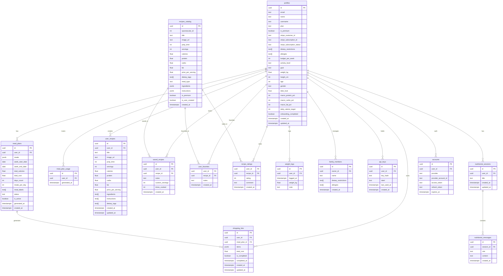

# Database Schema — MealMatch

MealMatch uses **Supabase (PostgreSQL)** as its primary database. Row Level Security (RLS) is enabled on all user-specific tables to ensure data isolation.

---

## Table of Contents

- [Entity Relationship Diagram](#entity-relationship-diagram)
- [Tables](#tables)
- [Relationships](#relationships)
- [RLS Policies](#rls-policies)
- [Indexes](#indexes)
- [Migrations](#migrations)

---

## Entity Relationship Diagram



---

## Tables

### `profiles`
Extends Supabase Auth users. Created automatically via database trigger on new user sign-up.

| Column | Type | Nullable | Description |
|---|---|---|---|
| `id` | `uuid` | No | Primary key, matches `auth.users.id` |
| `email` | `text` | No | User email |
| `name` | `text` | Yes | Display name |
| `username` | `text` | Yes | Unique username |
| `plan` | `text` | No | `free` \| `student` \| `premium` (default: `free`) |
| `is_premium` | `boolean` | No | Computed from plan (default: `false`) |
| `stripe_customer_id` | `text` | Yes | Stripe customer ID |
| `stripe_subscription_id` | `text` | Yes | Active Stripe subscription ID |
| `stripe_subscription_status` | `text` | Yes | `active` \| `canceled` \| `past_due` |
| `dietary_restrictions` | `text[]` | No | e.g. `['vegetarian', 'gluten-free']` |
| `allergies` | `text[]` | No | e.g. `['peanuts', 'dairy']` |
| `budget_per_week` | `int` | Yes | Weekly food budget in dollars |
| `activity_level` | `text` | Yes | `sedentary` \| `light` \| `moderate` \| `active` \| `very_active` |
| `goal` | `text` | Yes | `lose_weight` \| `maintain` \| `gain_muscle` |
| `weight_kg` | `float` | Yes | Body weight in kilograms |
| `height_cm` | `int` | Yes | Height in centimetres |
| `age` | `int` | Yes | Age in years |
| `gender` | `text` | Yes | `male` \| `female` \| `other` |
| `tdee_kcal` | `float` | Yes | Total Daily Energy Expenditure |
| `macro_protein_pct` | `int` | Yes | Protein % of calories |
| `macro_carbs_pct` | `int` | Yes | Carbs % of calories |
| `macro_fat_pct` | `int` | Yes | Fat % of calories |
| `daily_calorie_target` | `int` | Yes | Calculated daily calorie goal |
| `onboarding_completed` | `boolean` | No | Whether user finished onboarding (default: `false`) |
| `created_at` | `timestamptz` | No | Auto-set on insert |
| `updated_at` | `timestamptz` | No | Auto-updated via trigger |

---

### `meal_plans`
Stores AI-generated weekly meal plans. The `meals` JSONB field contains the full plan structure.

| Column | Type | Nullable | Description |
|---|---|---|---|
| `id` | `uuid` | No | Primary key |
| `user_id` | `uuid` | No | FK → `profiles.id` |
| `meals` | `jsonb` | No | Full meal plan data (see structure below) |
| `week_start_date` | `date` | No | Monday of the plan week |
| `week_end_date` | `date` | No | Sunday of the plan week |
| `total_calories` | `float` | Yes | Sum of all meal calories |
| `total_cost` | `float` | Yes | Estimated total cost |
| `days_count` | `int` | No | Number of days (5 or 7) |
| `meals_per_day` | `int` | No | Meals per day (1–3) |
| `meal_labels` | `text[]` | Yes | e.g. `['breakfast', 'lunch', 'dinner']` |
| `status` | `text` | No | `active` \| `draft` \| `archived` |
| `is_active` | `boolean` | No | Whether this is the active plan |
| `generated_at` | `timestamptz` | No | When the plan was generated |
| `created_at` | `timestamptz` | No | Auto-set on insert |

**`meals` JSONB structure:**
```json
{
  "monday": {
    "breakfast": {
      "id": "uuid",
      "title": "Oatmeal aux fruits rouges",
      "calories": 380,
      "protein": 12,
      "carbs": 65,
      "fat": 8,
      "prep_time": 10,
      "price_per_serving": 2.50,
      "image_url": "https://..."
    },
    "lunch": { ... },
    "dinner": { ... }
  },
  "tuesday": { ... }
}
```

---

### `meal_plan_usage`
Tracks how many meal plans a user has generated this month (for rate limiting).

| Column | Type | Description |
|---|---|---|
| `id` | `uuid` | Primary key |
| `user_id` | `uuid` | FK → `profiles.id` |
| `generated_at` | `timestamptz` | Timestamp of generation |

Usage is counted by querying rows where `generated_at >= start_of_current_month`.

---

### `recipes_catalog`
Central recipe database populated from Spoonacular and user-created recipes.

| Column | Type | Description |
|---|---|---|
| `id` | `uuid` | Primary key |
| `spoonacular_id` | `int` | Original Spoonacular ID (null for user-created) |
| `title` | `text` | Recipe name |
| `image_url` | `text` | Image URL |
| `prep_time` | `int` | Preparation time (minutes) |
| `servings` | `int` | Number of servings |
| `calories` | `float` | Calories per serving |
| `protein` | `float` | Protein (g) per serving |
| `carbs` | `float` | Carbohydrates (g) per serving |
| `fat` | `float` | Fat (g) per serving |
| `price_per_serving` | `float` | Estimated cost per serving ($) |
| `dietary_tags` | `text[]` | e.g. `['vegan', 'gluten-free']` |
| `meal_type` | `text` | `breakfast` \| `lunch` \| `dinner` \| `snack` |
| `ingredients` | `jsonb` | Ingredient list with amounts |
| `instructions` | `jsonb` | Step-by-step instructions |
| `is_premium` | `boolean` | Hidden from free/student users |
| `is_user_created` | `boolean` | Created by a user (not Spoonacular) |
| `created_at` | `timestamptz` | Auto-set on insert |

---

### `user_recipes`
Personal recipes created by users (stored separately from the main catalog).

| Column | Type | Description |
|---|---|---|
| `id` | `uuid` | Primary key |
| `user_id` | `uuid` | FK → `profiles.id` |
| `title` | `text` | Recipe name |
| `image_url` | `text` | Optional image URL |
| `prep_time` | `int` | Preparation time (minutes) |
| `servings` | `int` | Number of servings (default: 4) |
| `calories` | `float` | Calories per serving |
| `protein` | `float` | Protein (g) |
| `carbs` | `float` | Carbs (g) |
| `fat` | `float` | Fat (g) |
| `price_per_serving` | `float` | Estimated cost per serving |
| `ingredients` | `text[]` | List of ingredients |
| `instructions` | `text[]` | Preparation steps |
| `dietary_tags` | `text[]` | Dietary tags |
| `created_at` | `timestamptz` | Auto-set on insert |
| `updated_at` | `timestamptz` | Auto-updated via trigger |

---

### `user_favorites`
Junction table for user ↔ recipe favorites. Composite primary key.

| Column | Type | Description |
|---|---|---|
| `user_id` | `uuid` | FK → `profiles.id` (PK part 1) |
| `recipe_id` | `uuid` | FK → `recipes_catalog.id` (PK part 2) |
| `notes` | `text` | Optional personal note |
| `created_at` | `timestamptz` | When favorited |

**Constraint:** Free plan users are limited to 10 rows (enforced in API).

---

### `saved_recipes`
Recipes saved by users with additional personal data.

| Column | Type | Description |
|---|---|---|
| `id` | `uuid` | Primary key |
| `user_id` | `uuid` | FK → `profiles.id` |
| `recipe_id` | `uuid` | FK → `recipes_catalog.id` |
| `notes` | `text` | Personal notes |
| `custom_servings` | `int` | Override serving count |
| `times_cooked` | `int` | Cook count (default: 0) |
| `created_at` | `timestamptz` | Auto-set on insert |

---

### `shopping_lists`
Shopping lists generated from meal plans. Items are stored as a JSONB array.

| Column | Type | Description |
|---|---|---|
| `id` | `uuid` | Primary key |
| `user_id` | `uuid` | FK → `profiles.id` |
| `meal_plan_id` | `uuid` | FK → `meal_plans.id` (nullable) |
| `items` | `jsonb` | Array of shopping items (see structure below) |
| `total_cost` | `float` | Total estimated cost |
| `is_completed` | `boolean` | All items checked off |
| `completed_at` | `timestamptz` | When completed |
| `created_at` | `timestamptz` | Auto-set on insert |
| `updated_at` | `timestamptz` | Auto-updated |

**`items` JSONB structure:**
```json
[
  {
    "name": "Pâtes",
    "quantity": 500,
    "unit": "g",
    "price": 1.50,
    "checked": false,
    "aisle": "Pâtes & riz",
    "emoji": "🍝",
    "custom": false
  }
]
```

---

### `family_members`
Family members managed by a premium user for personalized meal planning.

| Column | Type | Description |
|---|---|---|
| `id` | `uuid` | Primary key |
| `owner_id` | `uuid` | FK → `profiles.id` |
| `name` | `text` | Member name |
| `dietary_restrictions` | `text[]` | e.g. `['vegetarian']` |
| `allergies` | `text[]` | e.g. `['peanuts']` |
| `created_at` | `timestamptz` | Auto-set on insert |

**Constraint:** Maximum 4 members per user (enforced in API).

---

### `nutritionist_sessions`
Chat sessions with the AI nutritionist (premium feature).

| Column | Type | Description |
|---|---|---|
| `id` | `uuid` | Primary key |
| `user_id` | `uuid` | FK → `profiles.id` |
| `title` | `text` | Auto-generated from first message |
| `created_at` | `timestamptz` | Auto-set on insert |
| `updated_at` | `timestamptz` | Updated on last message |

### `nutritionist_messages`
Individual messages within a nutritionist session.

| Column | Type | Description |
|---|---|---|
| `id` | `uuid` | Primary key |
| `session_id` | `uuid` | FK → `nutritionist_sessions.id` |
| `role` | `text` | `user` \| `assistant` |
| `content` | `text` | Message content |
| `created_at` | `timestamptz` | Auto-set on insert |

---

### `api_keys`
API keys for developer access (premium feature). Keys are hashed before storage.

| Column | Type | Description |
|---|---|---|
| `id` | `uuid` | Primary key |
| `user_id` | `uuid` | FK → `profiles.id` |
| `key_hash` | `text` | SHA-256 hash of the actual key |
| `label` | `text` | Human-readable label |
| `last_used_at` | `timestamptz` | Last API call timestamp |
| `created_at` | `timestamptz` | Auto-set on insert |

---

### `weight_logs`
Body weight tracking over time.

| Column | Type | Description |
|---|---|---|
| `id` | `uuid` | Primary key |
| `user_id` | `uuid` | FK → `profiles.id` |
| `logged_at` | `timestamptz` | When the weight was logged |
| `weight_kg` | `float` | Weight in kilograms |
| `note` | `text` | Optional note |

---

### `accounts`
OAuth provider accounts linked to a user (managed by NextAuth.js).

| Column | Type | Description |
|---|---|---|
| `id` | `uuid` | Primary key |
| `user_id` | `uuid` | FK → `profiles.id` |
| `provider` | `text` | `google` \| `github` |
| `provider_account_id` | `text` | ID from the provider |
| `access_token` | `text` | OAuth access token |
| `refresh_token` | `text` | OAuth refresh token |
| `expires_at` | `timestamptz` | Token expiry |

---

## Relationships

```
profiles (1) ──────── (N) meal_plans
profiles (1) ──────── (N) meal_plan_usage
profiles (1) ──────── (N) user_recipes
profiles (1) ──────── (N) saved_recipes
profiles (1) ──────── (N) user_favorites ──── (N) recipes_catalog
profiles (1) ──────── (N) shopping_lists ──── meal_plans (1)
profiles (1) ──────── (N) recipe_ratings
profiles (1) ──────── (N) weight_logs
profiles (1) ──────── (N) family_members
profiles (1) ──────── (N) api_keys
profiles (1) ──────── (N) nutritionist_sessions ── (N) nutritionist_messages
profiles (1) ──────── (N) accounts
```

---

## RLS Policies

Row Level Security is enabled on all user-specific tables. The pattern used throughout:

```sql
-- SELECT: users can only read their own rows
CREATE POLICY "Users can view own data" ON table_name
  FOR SELECT USING (auth.uid() = user_id);

-- INSERT: users can only insert rows for themselves
CREATE POLICY "Users can insert own data" ON table_name
  FOR INSERT WITH CHECK (auth.uid() = user_id);

-- UPDATE / DELETE: same pattern
```

**Tables with RLS enabled:**
- `profiles` — `id = auth.uid()`
- `meal_plans` — `user_id = auth.uid()`
- `meal_plan_usage` — `user_id = auth.uid()`
- `user_recipes` — `user_id = auth.uid()`
- `saved_recipes` — `user_id = auth.uid()`
- `user_favorites` — `user_id = auth.uid()`
- `shopping_lists` — `user_id = auth.uid()`
- `weight_logs` — `user_id = auth.uid()`
- `family_members` — `owner_id = auth.uid()`
- `api_keys` — `user_id = auth.uid()`
- `nutritionist_sessions` — `user_id = auth.uid()`
- `nutritionist_messages` — via `session_id` join to `nutritionist_sessions`

> **Note:** All Supabase calls in API routes use the **service role key** (`SUPABASE_SERVICE_ROLE_KEY`) which bypasses RLS. Ownership is verified manually in the route handler instead.

---

## Indexes

Recommended indexes for frequently queried columns:

```sql
-- Meal plans: lookup by user and week
CREATE INDEX idx_meal_plans_user_id ON meal_plans(user_id);
CREATE INDEX idx_meal_plans_week_start ON meal_plans(user_id, week_start_date);

-- Usage counting: monthly aggregation
CREATE INDEX idx_meal_plan_usage_user_month ON meal_plan_usage(user_id, generated_at);

-- Recipes: filtering
CREATE INDEX idx_recipes_catalog_meal_type ON recipes_catalog(meal_type);
CREATE INDEX idx_recipes_catalog_is_premium ON recipes_catalog(is_premium);

-- Shopping lists: lookup by meal plan
CREATE INDEX idx_shopping_lists_meal_plan ON shopping_lists(meal_plan_id);
CREATE INDEX idx_shopping_lists_user ON shopping_lists(user_id);

-- Nutritionist messages: ordered by session
CREATE INDEX idx_nutritionist_messages_session ON nutritionist_messages(session_id, created_at);

-- Weight logs: ordered by date
CREATE INDEX idx_weight_logs_user_date ON weight_logs(user_id, logged_at);
```

---

## Migrations

| File | Description |
|---|---|
| `supabase/DBSchema.sql` | Full initial schema |
| `supabase/plan-gating-migration.sql` | Adds `is_premium` to `recipes_catalog`, creates `family_members` and `api_keys` tables |
| `supabase/nutritionist-chat-sessions.sql` | Creates `nutritionist_sessions` and `nutritionist_messages` tables |

**Applying migrations:**
```bash
# Using Supabase CLI
supabase db push

# Or manually in the Supabase SQL editor
# Copy the contents of each .sql file and run it
```
